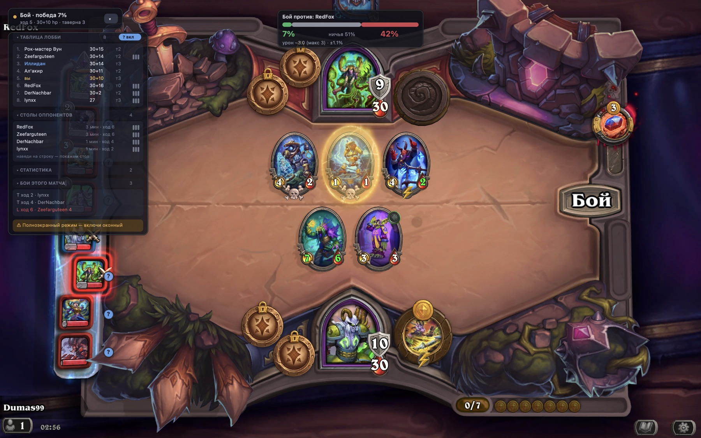
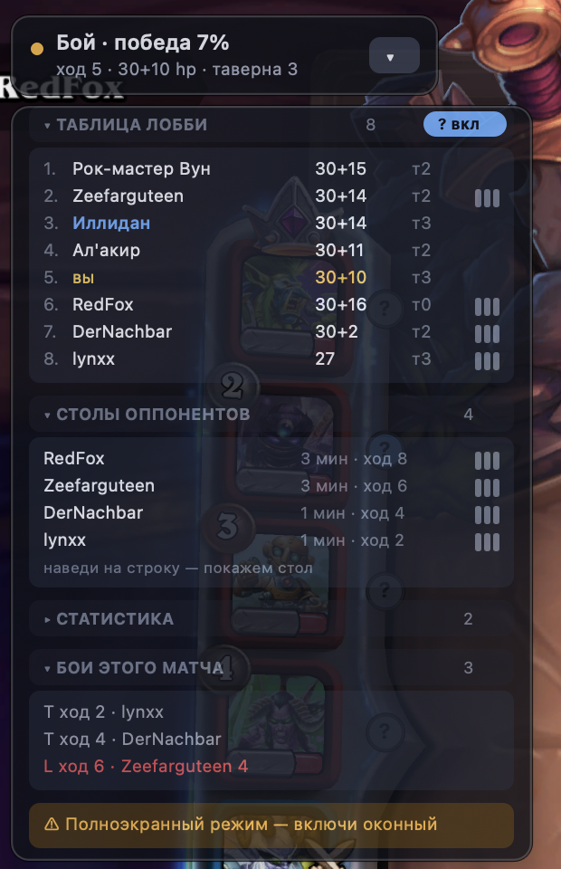
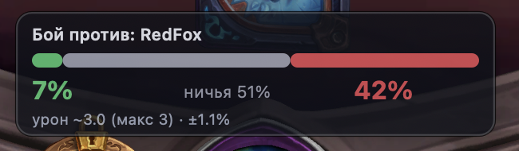
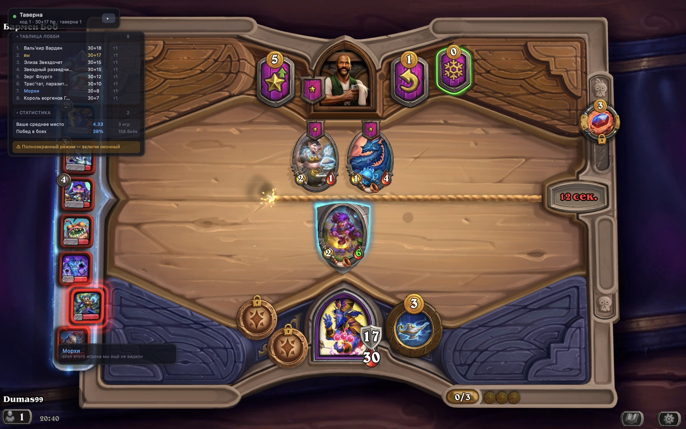

# HSBG Overlay — a Hearthstone Battlegrounds overlay for macOS

Shows the win probability of the fight you are about to watch, the last known
board of every opponent, the lobby table, a minion pool tracker and stats from
your own matches — pinned on top of the Hearthstone window.

**Read-only.** It parses `Power.log`, the file the game writes by itself. No
process memory reads, no injection, no network traffic with the game — the same
mechanism HSTracker and Hearthstone Deck Tracker are built on.

[Русская версия README](README.ru.md) · macOS 12+ · Python 3.13 · MIT



*The overlay speaks whatever language the game does. This client runs
Hearthstone in Russian, so the overlay is in Russian; an English client gets
English labels, and nothing has to be configured for that.*

---

## Contents

- [What it shows](#what-it-shows)
- [Requirements](#requirements)
- [Install](#install)
- [Build a real .app](#build-a-real-app)
- [Important: windowed mode](#important-windowed-mode)
- [The interface](#the-interface)
- [Simulator accuracy](#simulator-accuracy)
- [What is not modelled](#what-is-not-modelled)
- [Settings](#settings)
- [Developer tools](#developer-tools)
- [How it works](#how-it-works)
- [Tests](#tests)
- [License](#license)

---

## What it shows

| | |
|---|---|
| **Fight odds** | win / tie / loss from a Monte-Carlo simulation of the actual boards, with expected and maximum damage, a confidence interval and lethal risk |
| **Opponent boards** | every board you have been shown this match, replayed as real cards with the stats they had going into the fight |
| **Lobby table** | all 8 players: placement, health, tavern tier |
| **Minion pool** | how many copies of a minion are left in the shared pool and how many are already sitting on other boards |
| **Your stats** | average placement, combat win rate, results with the hero you are playing right now |
| **This match's fights** | every fight so far with the damage actually taken |

## Requirements

- macOS 12 or newer, Apple Silicon or Intel
- Python 3.13 (`brew install python@3.13`) — only for running from source
- Hearthstone in **windowed** or **borderless windowed** mode (see below)

The only runtime dependency is PyObjC. Card names and art come from
[HearthstoneJSON](https://hearthstonejson.com/) and are cached on disk.

## Install

```bash
git clone https://github.com/Dimus99/hsbg-overlay.git
cd hsbg-overlay
./setup.sh
```

`setup.sh` creates a virtualenv on Python 3.13 (arm64 when available) and
installs PyObjC. Then check the environment:

```bash
./run.sh --check
```

```
— Environment check —
  log folder         : /Applications/Hearthstone/Logs/Hearthstone_2026_08_21_02_18_13
  log.config         : log.config already has everything we need.
  game language      : enUS (setting: auto)
  fullscreen         : no
  card database      : 5738 cards, 734 effects derived
  Hearthstone running: yes
  game window        : WindowRect(x=0.0, y=0.0, width=1440.0, height=900.0)
```

On the first run the overlay writes the `[Power]` and `[LoadingScreen]` sections
into `~/Library/Preferences/Blizzard/Hearthstone/log.config` — **restart
Hearthstone once** afterwards so the game starts writing them.

Run it:

```bash
./run.sh
```

A **BG** item appears in the menu bar; from there you can hide the overlay,
toggle the hover pins, turn on the debug journal or quit.

## Build a real .app

To launch it without a terminal:

```bash
./make_app.sh                 # builds into dist/
./make_app.sh /Applications   # builds and installs
```

`dist/HSBG Overlay.app` (~23 MB) carries its own Python, PyObjC and the `hsbg`
package, so it depends on neither this folder nor the `.venv`: drag it to
`/Applications`, to the Dock, or copy it to another Mac.

Double-clicking it opens a small control window:

* **Start / Stop** — starts and kills the overlay; the button label and the
  status line say whether it is running right now.
* **Check environment** — the same output as `./run.sh --check`, printed into
  the window.
* A live tail of the log at the bottom, so a failed start is visible instead of
  "nothing happened".

The overlay runs as a separate process, so the window can be closed while it
keeps working; reopen it later to stop it. The same window is available without
building: `./run.sh --launcher`.

Output goes to `~/Library/Logs/HSBG-Overlay.log`. Settings and the card cache
live in `~/Library/Application Support/hsbg-overlay/` and are shared between the
bundle and the terminal.

The build is described by `packaging/hsbg.spec` (PyInstaller), the entry point
is `packaging/entry.py`, the icon is drawn by `tools/appicon.py`. PyInstaller is
a build-time dependency only — `make_app.sh` installs it itself.

**Signing.** The bundle is ad-hoc signed, which is enough to run it on the Mac
that built it. Distributing to other Macs properly needs a Developer ID and
notarisation; without that, macOS quarantines a downloaded bundle and refuses to
open it. Clearing the quarantine flag is the workaround:

```bash
xattr -cr "/Applications/HSBG Overlay.app"
```

## Important: windowed mode

macOS will not draw over an application in **exclusive fullscreen** — the game
window moves to a Space of its own. In Hearthstone's settings (Graphics) pick
**Windowed** or **Borderless Window**. Without it the overlay still works
correctly, it just stays behind the game. `./run.sh --check` reports the current
mode, and the overlay itself shows a warning line.

Screen recording permission is **not** required — window geometry comes from the
public window list.

## The interface

Four independent windows instead of one long panel, each with its own job.



### 1. The status pill (always on screen)

Small, in the corner of the game window. During a fight it reads
`Combat · win 62%`; the rest of the time it shows the turn, health and tavern
tier. The **▾ / ▸** button collapses and expands *everything else*, and the
state is remembered between runs.

### 2. The odds card (during a fight only)



Appears **top centre of the game window** — where you are already looking during
a fight — and disappears once the fight has played out. Inside: the
win/tie/loss bar, expected and maximum damage, the confidence interval, lethal
risk, and an accuracy note when the boards hold cards the engine cannot parse.
Nothing is computed outside of combat, so the CPU is free while you shop.

**Why the timing was not obvious.** Hearthstone dumps the whole fight into the
log in one burst and only then animates it. Measured over nine fights in a row:
the log was finished 0.3–1.8 seconds in, while the player's first real click in
the tavern came **20–84 seconds** later. Every in-log "the fight is over" signal
fires inside that burst, and estimating the animation length from the number of
attacks cut the card off mid-fight.

So the end signal is the player: the odds stay up **until your first action in
the tavern**, with a 60 second fallback (`combat_hold_seconds`) in case you never
click anything.

**End of match is a separate signal.** The fallback had a downside: the match is
over, you are already picking the next one from the Battlegrounds menu, and the
overlay still shows odds from a game that no longer exists. `Power.log` has no
answer — the last match sits there until the next `CREATE_GAME`. So a second
source is read: `LoadingScreen.log`, where the game records the screen change
(`GAMEPLAY` → `BACON`). Leave the match scene and the odds, the "?" pins, the
turn counter and in-game hovering all go dark, and the pill returns to "waiting
for a Battlegrounds match". If the `LoadingScreen` section is not in `log.config`
yet, the scene is unknown and the overlay assumes the match is running rather
than blanking itself over a missing log.

**Before there is a prediction, there is a loading card.** Between the start of
combat and the first attack the game is still writing out the opponent's board:
the fight has begun, but it is too early to read. That window used to show the
*previous* fight's odds for a second or two. Now a spinner with the opponent's
name takes that place, at the same width and title as the finished card so
nothing jumps.

### 3. Collapsible blocks

Under the pill. Clicking a header collapses the block, and the state is saved.

| Block | What is in it |
|---|---|
| **Hero pick** | only during hero selection: each hero with your average placement on it, plus the global one if an external source is configured |
| **Lobby table** | all 8 players: placement, health, tavern tier |
| **Opponent boards** | who has been seen, how many minions they had and when; rows with a saved board carry a three-bar mark on the right — hover one and the board pops up |
| **Stats** | your average placement, combat win rate, results with the current hero |
| **This match's fights** | fight history with the damage actually taken |



### 4. Hover popups

They appear at the cursor and occupy nothing permanently.

* **Hover a hero** — in the overlay's lobby table *or on the player's portrait
  in the game itself* — and their last board pops up **as real cards**, the way
  it looked at the start of the fight. Live attack and health from the log are
  drawn over the art: the card itself prints base numbers, and what matters is
  what the minion actually fought with. If the board has never been seen there is
  no popup at all — the grey "?" pin already says so, and an extra panel would
  only cover the game.

  Art is the raw art from HearthstoneJSON with a frame of our own. Finished card
  renders would look better, but they only cover older sets: 11 of 13 minions in
  a current match returned 404. Art exists for every card, and an own frame also
  puts the live stats where they read. Golden cards use the normal version's art
  and get a golden frame. Everything is cached on disk.

* **Hover a minion in the tavern** — a popup says how many copies of that card
  are left in the shared pool, how many are already on other boards, and what the
  card does.

Hearthstone does not log mouse hovering, so hovering **inside the game** is
derived from the cursor position relative to the window. The zones are defined as
fractions of the window, so they survive a resolution change, but they are still
an estimate of Blizzard's layout.

Because the zone is invisible, you had to wave the cursor around to find it.
So small **"?" pins** can be drawn over the game's own portrait rail — one per
slot. The pin *is* the hover point: blue means we have that player's board, grey
means we have not seen it yet, gold means the cursor is on it. Your own portrait
gets none.

**The in-game popup fires only on the pin itself, and only while pins are on.**
The hotspot used to be the entire rail strip, so an opponent's board would jump
out when the cursor merely passed to the left of the portraits. Drawing and
hit-testing are now the same function (`hover.mark_layout`): no pin, no hover.
Through the overlay's own panel the boards open as always.

Pins live **separately from the panels**: they are drawn over the game's own rail
and have their own switch, so collapsing the overlay does not remove them. That
is in fact the main way to watch other boards without covering the game.

**They are off by default** — they sit on top of someone else's picture. The
switch is the **"? on / ? off"** pill in the lobby table's header, and the same
toggle is in the **BG** menu bar item, which is reachable even when the panels
are collapsed. The state is saved (`show_hover_marks`).

If the pins do not line up with the portraits, record the zone from two corners:

```bash
./run.sh --tool calibrate -- --set leaderboard
```

The tool asks you to point at the top-left corner of the topmost portrait and
the bottom-right corner of the bottom one, then writes the zone into the
settings. Without `--set` it just prints the fraction under the cursor:

```bash
./run.sh --tool calibrate
```

The values can also be written by hand into `settings.json`:

```json
"extra": {"hover_zones": {"leaderboard": [0.0, 0.09, 0.085, 0.96],
                          "tavern":      [0.20, 0.215, 0.80, 0.42]}}
```

Hovering rows inside the overlay itself is exact and needs no calibration.

---

## Simulator accuracy

The simulator models **exactly** everything the log contains: attack, health,
Divine Shield, Taunt, Poisonous/Venomous, Reborn, Windfury, plus attack order,
target selection and damage to the hero.

The key trick: the snapshot of both boards is taken **right before the first
attack**, not at the start of the combat phase. By then the game has already
applied every start-of-combat effect — hero powers, trinkets, Rally, auras — and
they land in the stats for free, without a single line of modelling.

The trick has exactly one hole: a hero power that reacts to an event which has
**not happened yet** at snapshot time. Those are read from the database by the
hero's `heroPowerDbfId`, and there are three of them:

| Power | What it does in the fight |
|---|---|
| Greybough | "+1/+2 and Taunt to minions summoned in combat" — two identical 1/1 boards diverge into a loss: his skeletons come up 2/3 with Taunt, yours stay 1/1 |
| Rokara | "when a friendly minion kills an enemy, give it +1 Attack permanently" — the counter grows mid-fight |
| Drek'Thar, Vanndar | "when a space opens in combat, summon a copy of the strongest/toughest minion" — only armed if the board entered combat **full**: with 6 minions the game already summoned the copy before the snapshot, and it is in it |

Every other power either works in the tavern or fires at the start of combat —
both are already baked into the snapshot's stats.

**Trinkets.** Of 390 trinkets, 283 work in the tavern only; of the rest, two
classes act in combat in a way the snapshot cannot show:

| Class | What is modelled |
|---|---|
| "when a space opens, summon…" | Automaton Portrait (the real 3/4 Ancestral Automaton), Boom Controller (an exact copy of the first Mech that fell — buffs included, not a clean one). Armed like Drek'Thar's: unconditional ones only if the board entered combat full, death-driven ones always |
| `Avenge (N)` | the counter lives **on the board**, not on a minion: a trinket has no body, it cannot be killed or silenced. Bird Feeder, Beetle Band, Staff of the Scourge, Gilnean Thorned Rose |

The ids are read from the log — yours by controller, the opponent's by id from
the combat setup block (the opponent gets a fresh proxy controller every fight,
so filtering by it is impossible). Placeholder "Lesser/Greater Trinket" cards are
dropped. Trinket coverage on boards went from **0% to 56%**: the `trinkets` field
existed from the start and reached the simulator, but was never filled.

**Tribes on tokens.** "Summon a 2/2 Beetle" used to parse into a nameless body
with no tribe, so every tabular buff ("give your Beasts +4/+4") missed the very
bodies the card had just created. The real card is now looked up by the name in
the text — id, tribe, tier and keywords — while the printed stats stay
authoritative.

Mechanics the log does not contain are extracted **automatically from card text**
in the English HearthstoneJSON database into a machine form and played by the
engine:

| Mechanic | What is modelled |
|---|---|
| Deathrattle | token summons (with the real stats of the named card), random summons from the pool ("2 random Deathrattle minions", "a random Beast from tier 2–4", "4 random Pirates"), damage (random / all / weakest / adjacent), buffs, keyword grants, stat transfers, killing or buffing the killer, returning fallen Mechs from the graveyard, summoning from hand (by attack, by health, random — with a buff on the way out), "make the one on the right golden", triggering another minion's deathrattle |
| **Rally** | the struck target: damage to it and its neighbours, "damage equal to its own attack", "set its stats to 3/3", "remove its Reborn and Taunt", "steal its attack"; plus positional buffs, Blood Gems on itself and on the rest of the board, doubling its own stats, "gain attack equal to your tier", self-destruction after the hit, triggering another deathrattle (Monstrous Macaw), "once/twice per combat" limits |
| Avenge | trigger threshold, buffs, damage, Blood Gems |
| Frenzy | fires once, on the first damage survived |
| "When this takes damage" | buffs, summons, "twice per combat" limits |
| "After this kills a minion" | stat growth, "gain its max stats", separately "after it attacks and kills" |
| "When a friendly minion dies" | Avenge counters, "gain its attack/stats", **"gain its deathrattle"** (Fish of N'Zoth accumulates other deathrattles) |
| "Whenever you summon a minion" | both "during combat" and "in combat" — buff the summoned minion, buff itself, keywords |
| Cleave, shield loss | as before |
| **Auras over other triggers** | Titus Rivendare: "your deathrattles trigger twice" — the multiplier is read **at the moment the deathrattle fires**, so a Titus who fell in the same wave of deaths doubles nothing; golden gives ×3. A deathrattle triggered by another card (Monstrous Macaw, Deathstrider) is multiplied too, as in the game |
| **"After a friendly Rally minion attacks"** | Deathstrider: "trigger your leftmost deathrattle" (golden: twice). A separate hook from the usual "when a friendly minion attacks": it looks for the Rally keyword on the attacker and fires **after** the exchange, not before. A Windfury minion runs it twice per turn |
| **"Your Beetles get +5/+5 this game"** | not a buff on standing bodies but an order applying to every token summoned from then on: it accumulates on the board, survives the death of whoever granted it, and reaches every new Beetle at summon time |

### The board that grows itself

The Beetle board — the fight in the journal that was promised 0% and won —
stands on three mechanics, each harmless on its own: **Deathstrider** triggers
the leftmost deathrattle after every Rally attack, **Turquoise Skitterer** grants
Beetles +5/+5 "this game" through that deathrattle, and **Titus Rivendare**
doubles both. A golden Gryphon with Windfury runs the chain twice a turn. None of
the three was parsed: the engine saw vanilla bodies and confidently called the
fight lost.

Order inside a deathrattle matters exactly as much as in the card text: "Your
Beetles get +5/+5 this game. **Then** summon a 2/2 Beetle" — the order first,
the body second, otherwise the first Beetle comes out without the bonus the card
just granted.

**Measured.** 212 fights from three recorded logs, the same set, run twice — with
the old effect table and the new one. Outcomes guessed 80.2% → 80.7%, Brier
0.1233 → 0.1208, "confidently wrong" (under 2% probability on what happened)
19 → 16. Three fights moved by more than 5 points, all three toward what actually
happened: `84→98%`, `86→92%`, `34→82%`, and all three were wins. No fight moved
the wrong way. The gain is modest precisely because the package is narrow: it
came up three times in two hundred.

**What is still missing.** The bonus accumulated over previous turns is not
visible in the snapshot: the fight starts at "Beetles +0/+0" even when the game
has +150/+150 there by then. Predictions are low as a result, so such cards are
**deliberately marked as not fully parsed** (`game_carryover`) — the overlay
shows "accuracy ~71%" instead of certainty about a loss.

Three tricks that raised coverage by dozens of cards at once:

* **A shared trigger header.** "Battlecry, Deathrattle, and Rally: give the
  others +2/+2" — one text for three triggers. The splitter looked for the
  `Deathrattle:` marker, did not find it and filed the card as a vanilla body.
  Such a header is now expanded into a separate sentence per trigger.
* **Spells by name.** "Rally: Cast Queen's Command" — the spell itself is almost
  always a plain buff, so its text is substituted into the clause before parsing.
* **Plural tribes.** "4 random Pirates" did not match the `PIRATE` tribe, because
  the table holds the singular — and summoned nothing.

Whatever cannot be derived from text lives in `MANUAL_EFFECTS` (currently empty —
not one card had to be written by hand).

### Measured on 235 real fights from your own logs

`tools/accuracy.py` compares each prediction against the **actual** outcome of
that fight, taken from the same log.

The outcome comes from the log itself: the game prints `META_DATA - Meta=DAMAGE`
naming whose hero took damage — that *is* the result, no guessing. It used to be
derived from the health difference between fights, and the labels lied: a fight
of "my 4/4 against a 1/1" was recorded as a loss. Of 279 fights, 245 are now
labelled directly by the log; the remaining 34 (mostly ties, where nobody takes
damage) by the old heuristic.

Measured on 206 fights from fresh logs (after that fix / before it):

| Metric | Now | Before |
|---|---|---|
| Most likely outcome guessed | 79.1% | 79.7% |
| Brier score of the win probability | 0.132 | 0.126 |
| Mean damage error | 2.0 | 1.9 |
| Card coverage | **97%** | 95% |
| Fights parsed **completely** | **168 of 206** | 138 of 202 |

An honest result: the summary numbers did not move — they wander ±1.5 pp from run
to run, and the new mechanics were simply rare in these fights. What moved is
something else: 30 more fights are now parsed **in full**, so the overlay stopped
attaching "accuracy ~85%" to them.

An earlier measurement over 286 fights:

| Metric | Without the damage cap | With it |
|---|---|---|
| Most likely outcome guessed | 77.5% | 77.5% (±0.8) |
| Brier score of the win probability | 0.162 | 0.162 (0.25 = a coin) |
| Mean damage error | 4.3 | **2.6** |
| Predictions above the game's cap | 67 of 284 | **0** |
| Card coverage | 98% | 98% |

The share of guessed outcomes wanders ±1.5 pp between runs: in plenty of fights
the odds are near 50/50, and "the most likely outcome" flips there on the random
draw. The Brier score is stable — that is the number to compare.

**The damage cap.** Battlegrounds limits the damage of a lost fight: 2 early in
the match, then 5, 10 and 15 — the game writes it in the `BACON_COMBAT_DAMAGE_CAP`
tag. The simulator could account for it, but the application never passed the
value, so the overlay promised "damage ~32" where the game could not take more
than 15. The cap is now read from the log and reaches both the damage forecast
and the lethal risk.

**What remains.** Over 286 fights, 32 times (11%) the engine was 90%+ confident
and wrong. Those are real simulator misses rather than bad labels, and going
through them one by one continues.

The overlay shows `accuracy ~85% · not modelled: <cards>` when the boards hold
cards with an unparsed combat trigger — treat the win percentage with more
suspicion then. Triggers that fire in the tavern or in hand ("gain a Blood Gem",
"give a minion in hand +7/+7") do not lower coverage: they do not affect this
fight. Neither does start-of-combat — that is already baked into the stats.

Re-measure on your own logs at any time:

```bash
./run.sh --tool accuracy
```

### Performance

Measured on this machine (Apple Silicon, 803 MB of logs):

| Stage | Result |
|---|---|
| Log parsing | 185k lines/s — ~185× headroom against a live game |
| A 7×7 fight, 2000 runs | 0.53 s over 8 processes (3,772 runs/s) |
| Overlay at rest | 2–3% of one core, 120 MB |
| First parse of the history | ~30% of one core, then 0.9 s from cache |

Python is not the bottleneck here. The prediction is computed once per fight and
takes half a second against 8–40 seconds of animation, and accuracy is not
limited by the number of runs: 2000 iterations give ±2.2 pp of statistical
spread, while the systematic error from unmodelled cards is around ±10 pp.
Rewriting the engine in Rust would remove the ±2.2 and leave the ±10 untouched.

Where a fast language would genuinely help is searching minion placements
(7! = 5040 orders × 1000 runs ≈ 5M fights). That is ~12 minutes in Python and
seconds in Rust. If that suggestion is ever wanted, the thing to move into a
native module is the combat engine alone.

### Comparing trajectories: what to fix next

Outcome measurement (`tools/accuracy.py`) says *how often* the engine is wrong,
never *why*: a 7×7 fight is forty swings, and one wrong rule anywhere flips the
result. But `Power.log` names **both sides of every swing** — the
`PROPOSED_ATTACKER` / `PROPOSED_DEFENDER` tags inside each `ATTACK` block (the
block header's `Target=` is always 0, there is nothing there). That is a ready
list of the game's own moves.

`tools/divergence.py` pins the simulator to that list: at every step it asks the
engine who it would attack with, compares against reality and **forces** the real
choice, so the replay never leaves the true trajectory. Target randomness stops
interfering and only rule mismatches remain, of two kinds:

| | what it means |
|---|---|
| `order` | the engine picked a different attacker — attack pointer, summon position, Windfury accounting |
| `state` | the engine thinks the real attacker or its target is already dead — an effect was not played |

Bodies summoned during a fight have no id in the simulator, so they are matched
to log ids by card. If they cannot be matched, the replay **stops** rather than
reporting a divergence: leaving the tracked zone is not an engine bug, and
counting it as one would drown the real findings. Only the **first** divergence
in a fight counts — everything after it follows from an already-diverged board.

```bash
./run.sh --tool divergence -- --min-swings 2
```

Recording the course of a fight (`CombatRecord.trace`) is enabled by the
`trace_combat` flag and off by default — a live overlay has no use for it.

The tool immediately reordered the priorities. The hypothesis "attack order is to
blame" was **not confirmed**; the blame is on bodies the engine does not create.
Over 194 fights:

| | before | after |
|---|---|---|
| watched to the last swing | 32.1% | **37.1%** |
| left the tracked zone | 59.8% | **51.5%** |
| median share of swings before stopping | 42% | **46%** |
| Brier | 0.140 | **0.137** |

It also prints a **ranked list of cards** the game summoned and the simulator did
not — a work queue instead of guesswork.

### The combat journal (debugging)

The **BG** menu bar item has a **"Debug: combat journal"** toggle and an **"Open
journal folder"** item next to it. Off by default — it is diagnostics, not
something a normal session needs.

When on, every finished fight appends one JSON line to
`~/Library/Application Support/hsbg-overlay/debug/combats-YYYY-MM-DD.jsonl`: the
prediction, the actual outcome, **both boards in full** (stats, keywords,
positions, trinkets, hand) and a `surprise` field — how much probability the
prediction gave to anything other than what happened. The boards are written in
full deliberately: `Power.log` rotates and runs to tens of millions of lines,
while this one line reproduces the fight a week later.

Read the journal:

```bash
./run.sh --tool debugreview -- --boards
```

It prints a calibration table ("of the fights promised 0–2%, how many were
actually won") and sorts the misses by confidence. The most valuable case is
**0% and a win**: that is not variance — 2000 runs found no path to victory, so
the board in the simulator was not the board in the game.

The very first run over recorded logs found exactly such a fight — a giant board
lost to seven small minions — and named the culprits: **Titus Rivendare** and
**Deathstrider**. The engine played neither **and did not mark them as
unparsed**, so the overlay showed "100% coverage" next to a 100% wrong
prediction. First came the marking, then the modelling — see "The board that
grows itself" above.

**Two traps in the journal itself**, which made it lie about what happened.

*The prediction was attached to the wrong fight.* The simulation runs on its own
thread for a second or more, and the log reader does not wait. The finished
answer used to be stitched onto `state.current_combat` **at the moment the
computation ended** — that is, onto whichever fight had become current by then.
In normal play that is a rare race, but the overlay starts by reading the log
from the last `CREATE_GAME`, and a whole played-out match flies through the
parser in a couple of seconds, where it is the rule rather than the exception. In
the journal it looked like "promised 0%, won": the numbers were honest, just from
a different turn. The fight now travels together with its boards from
`_matchup()` to the write.

*One match was written to the journal on every restart.* The same startup
re-read replays all past fights and honestly "counts" each one — with an empty
prediction, because there was nothing to predict. Duplicates piled up in the
file and the calibration table counted them as separate observations. The log
reader now reports whether it has caught up with the writer
(`PowerLogTailer.caught_up`), and fights from that tail do not reach the journal.

## What is not modelled

74 unparsed combat triggers remain across 71 cards (counting golden versions
separately) — 42 unique cards, 14 of them marked only for the invisible
"accumulated this game" tail. What is left:

* **trinkets** beyond the two parsed classes: those that grant minions a
  deathrattle ("give your Quilboar 'Deathrattle: gain 2 Blood Gems'") and those
  that depend on "the first minion summoned this combat" (Twin Sky Lanterns);
* **Blood Gems as a counter**: "summon a Golem with stats equal to this minion's
  Blood Gems" (Corrupted Bristler, Prison Juggernaut, Warped Bristler) — how many
  gems are on a minion is not visible in the snapshot;
* **immediate attacks**: "your leftmost minion immediately attacks whatever
  killed this" (Seasoned Technician), Onyxia's whelps — the engine can summon the
  body but not give it an out-of-order swing;
* **other minions' battlecries**: "trigger a neighbour's battlecry" (Rylak,
  Gardener) — battlecries are not played in combat at all;
* **stat thresholds**: "once its attack reaches 6, gain Divine Shield" (Crimson
  Survivor) — nobody watches stats mid-fight;
* **transformations**: "Avenge (5): become a copy of the minion on the left"
  (Karmic Chameleon), magnetising from a deathrattle (Apexis Sentinel);
* **accumulated "this game"**: how many times your Beetles were given +5/+5 over
  the past ten turns is written nowhere in the snapshot; only what accumulates
  inside the fight itself is modelled;
* cards that depend on the **opponent's hand** — the hand is simply not in the
  log, and that is fundamental: your own hand is accounted for, theirs never is;
* Duos (paired Battlegrounds).

**Reborn and Divine Shield.** There was a hypothesis that Reborn brings a card
back with its *printed* keywords, i.e. restores a popped Divine Shield.
Implemented, measured over 207 fights — and accuracy fell from 79.7% to 74.4%,
Brier from 0.128 to 0.181. The game does not restore the shield; the body comes
back exactly as it fell, minus its life and minus Reborn itself. The hypothesis
was reverted and the finding written into a comment in `engine.summon_reborn` so
nobody reopens it.

A fresh list at any time:

```bash
./.venv/bin/python -c "from hsbg.carddb import get_db; db = get_db(); spec = db.derive_effects(); print('\n'.join(sorted({db.name(i) + ' ' + str(s['unmodelled']) for i, s in spec.items() if s.get('unmodelled')})))"
```

## Settings

`~/Library/Application Support/hsbg-overlay/settings.json` (created on first run):

| Key | Default | Meaning |
|---|---|---|
| `iterations` | 2000 | simulations per prediction |
| `sim_workers` | 0 (auto) | processes used for the simulation |
| `sim_time_budget` | 2.5 | seconds; run fewer iterations rather than overrun |
| `combat_hold_seconds` | 60 | fallback before the odds card hides itself |
| `language` | `auto` | `auto` / `ruRU` / `enUS` / any HearthstoneJSON locale; sets both card names and the overlay's own labels |
| `anchor` | `top-left` | which corner of the game window to pin to |
| `offset_x`, `offset_y` | 16 | margin from the edge |
| `overlay_opacity` | 0.88 | opacity |
| `overlay_scale` | 1.0 | scale |
| `show_opponents`, `show_leaderboard`, `show_pool`, `show_stats` | `true` | which data to collect |
| `show_when_hs_inactive` | `false` | keep the overlay on screen even when Hearthstone is not focused or not running |
| `show_hover_marks` | `false` | "?" pins on the opponents' portraits in the game |
| `extra.hidden` | `false` | whether the overlay is collapsed down to the pill |
| `extra.collapsed` | `{}` | which blocks are collapsed |
| `extra.hover_zones` | — | calibration of the in-game hover zones |
| `offline` | `false` | never touch the network (needs a warm card cache) |
| `debug_log` | `false` | write the combat journal |

The language is detected automatically, and the overlay labels itself in it: an
English client gets an English interface, a Russian one gets Russian. Sources, by
decreasing authority: the `SetLocale:` line at the top of `Hearthstone.log` (what
the game actually chose at startup), the selected text language in Battle.net's
`.product.db`, Battle.net's own language, the shell locale. Reading `.product.db`
had to be done by protobuf field numbers: the list of *installed* languages sits
next to the selected one, and searching the whole file found Russian for everyone
who merely had it downloaded. Switching the game's language needs no edits here —
just restart the overlay afterwards. Internally everything is keyed by `cardId`,
which does not depend on language; the overlay's own labels live in `hsbg/i18n.py`.

### External statistics

The public Battlegrounds statistics sites (HSReplay, Firestone) are behind
Cloudflare bot protection and have no open API, and working around the protection
was out of scope. So no external source is configured by default and the stats —
including the labels under heroes during selection — are computed from your own
logs. If you have a suitable source, add it to `settings.json`:

```json
"extra": { "stats_url": "https://example.com/bgs-heroes.json" }
```

Expected format:

```json
{"heroes": [{"cardId": "TB_BaconShop_HERO_93", "averagePlacement": 4.21, "games": 12045}]}
```

---

## Developer tools

```bash
./run.sh --tool replay     -- --combats --sim   # parse a log, print boards and predictions
./run.sh --tool accuracy   -- --iterations 800  # measure accuracy on your own logs
./run.sh --tool preview    -- --combat 5        # show the overlay against a recorded match
./run.sh --tool divergence -- --min-swings 2    # compare the engine against the game's own swings
./run.sh --tool debugreview -- --boards         # read the combat journal
./run.sh --tool calibrate                       # calibrate the in-game hover zones
./run.sh --headless                             # no window, console output
```

## How it works

```
hsbg/
  logfiles.py    finding and following the game's logs: Power.log and
                 LoadingScreen.log (survives a game restart)
  powerlog.py    log tokeniser -> event stream + entity table
  gamestate.py   lobby state: boards, leaderboard, fight history
  carddb.py      HearthstoneJSON card database + mechanics extracted from text
  sim/           combat engine, effect registry, Monte-Carlo runner
  pool.py        minion pool tracker
  stats.py       stats from local logs + an optional external source
  i18n.py        interface labels in the language the game runs in
  ui/            AppKit windows, drawing, hit-testing under the cursor
  app.py         wiring the threads: log + scene -> state -> simulation -> overlay
  launcher.py    the start/stop window: runs and kills the overlay, tails the log
```

The key parsing detail: during a fight the game copies the opponent's board under
a "ghost" player (the one whose `GameAccountId` is zero) — and the tavern's own
minions land there too. They can only be told apart by which entities were created
inside the combat-start block; that is how the opponent's line-up is determined.

## Tests

```bash
./.venv/bin/python tests/test_sim.py        # no dependencies beyond the venv
./.venv/bin/python -m pytest tests -q       # same checks under pytest
```

The suite covers the combat engine, effect extraction from card text, the log
parser, language detection and the interface labels in both languages. It runs
without a card database and without a network connection — the checks that need
HearthstoneJSON skip themselves when the cache is cold.

## License

MIT — see [LICENSE](LICENSE).

Not affiliated with or endorsed by Blizzard Entertainment. Hearthstone and
Battlegrounds are trademarks of Blizzard Entertainment, Inc. Card data and art
come from [HearthstoneJSON](https://hearthstonejson.com/).
