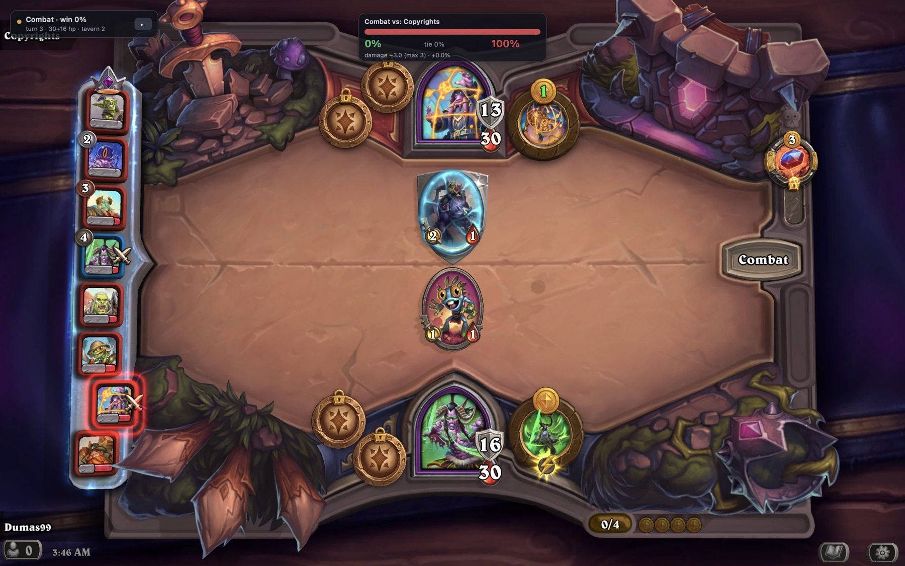
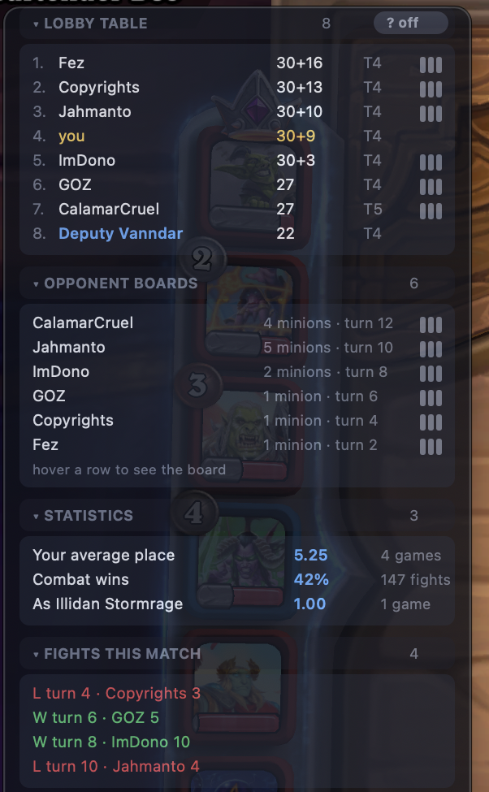
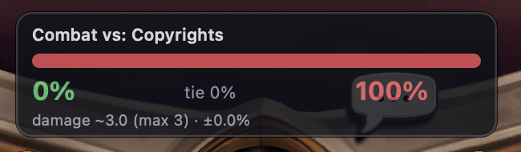
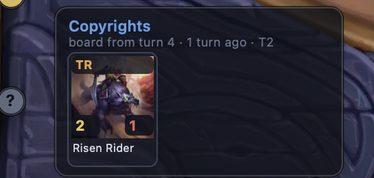

# HSBG Overlay — a Hearthstone Battlegrounds overlay for macOS

Shows the win probability of the fight you are about to watch, the last known
board of every opponent, the lobby table, a minion pool tracker and stats from
your own matches — pinned on top of the Hearthstone window.

**Read-only.** It parses `Power.log`, the file the game writes by itself. No
process memory reads, no injection, no network traffic with the game — the same
mechanism HSTracker and Hearthstone Deck Tracker are built on.

<sub>**The prediction is a simulation, not an oracle.** A handful of combat
triggers are still not modelled —
[the list](docs/ACCURACY.md#what-is-not-modelled). When one of them is on either
board the overlay says so on the odds card itself (`accuracy ~85% · not
modelled: <cards>`) instead of handing you a confident number it cannot back
up.</sub>

[Русская версия README](README.ru.md) · [Install guide](docs/INSTALL.md) · [Accuracy and internals](docs/ACCURACY.md) · macOS 12+ · Python 3.11+ · MIT



*The overlay labels itself in whatever language the game runs in, with nothing
to configure — English here, and Russian in the
[screenshots of the Russian README](README.ru.md).*

---

## Install

macOS 12 or newer, Apple Silicon or Intel. Python 3.11+ is needed only to run
from source — `setup.sh` prefers 3.13 (`brew install python@3.13`), and the
built `.app` carries its own. Copy the whole block:

```bash
git clone https://github.com/Dimus99/hsbg-overlay.git
cd hsbg-overlay
./setup.sh          # a .venv with PyObjC — nothing is installed system-wide
./run.sh --check    # log folder, game language, card database, game window
./run.sh            # start the overlay
```

On the first run the overlay writes the `[Power]` and `[LoadingScreen]` sections
into `~/Library/Preferences/Blizzard/Hearthstone/log.config` — **restart
Hearthstone once** afterwards so the game starts writing them. A **BG** item
then appears in the menu bar: hide the overlay, toggle the "?" pins, turn on the
debug journal or quit.

Screen recording permission is **not** required — window geometry comes from the
public window list. The only runtime dependency is PyObjC; card names and art
come from [HearthstoneJSON](https://hearthstonejson.com/) and are cached on
disk. Step by step, with a troubleshooting table:
**[docs/INSTALL.md](docs/INSTALL.md)**.

### Without a terminal

```bash
./make_app.sh /Applications   # or plain ./make_app.sh to build into dist/
```

`HSBG Overlay.app` (~23 MB) carries its own Python, PyObjC and the `hsbg`
package, so it depends on neither this folder nor the `.venv`: drag it to the
Dock or copy it to another Mac. Double-clicking opens a small window with
**Start / Stop**, a **Check environment** button and a live tail of the log, so
a failed start is visible instead of "nothing happened". The overlay runs as a
separate process, so the window can be closed while it keeps working; the same
window is available without building, via `./run.sh --launcher`.

The bundle is ad-hoc signed, which is enough to run it on the Mac that built it.
A bundle downloaded from elsewhere is quarantined by macOS until you clear the
flag:

```bash
xattr -cr "/Applications/HSBG Overlay.app"
```

Output goes to `~/Library/Logs/HSBG-Overlay.log`; settings and the card cache
live in `~/Library/Application Support/hsbg-overlay/` and are shared between the
bundle and the terminal. The build is described by `packaging/hsbg.spec`
(PyInstaller, which `make_app.sh` installs itself), the entry point is
`packaging/entry.py`, the icon is drawn by `tools/appicon.py`.

## What it shows

| | |
|---|---|
| **Fight odds** | win / tie / loss from a Monte-Carlo simulation of the actual boards, with expected and maximum damage, a confidence interval and lethal risk — plus a coverage warning when a board holds a trigger the engine cannot parse |
| **Opponent boards** | every board you have been shown this match, replayed as real cards with the stats they had going into the fight |
| **Lobby table** | all 8 players: placement, health, tavern tier |
| **Minion pool** | how many copies of a minion are left in the shared pool and how many are already sitting on other boards |
| **Your stats** | average placement, combat win rate, results with the hero you are playing right now |
| **This match's fights** | every fight so far with the damage actually taken |

## Is this allowed?

It reads `Power.log` — the file Hearthstone writes on its own, the same one
HSTracker and Hearthstone Deck Tracker have been reading for a decade. Nothing
is written back to the game, no process memory is touched, no packets are sent
and no input is automated: the overlay is a window drawn next to the game, and
it cannot click anything for you.

That puts it in the same category as the established trackers rather than
anywhere near a bot. It is not a promise about anyone's account — Blizzard's
rules are Blizzard's to interpret, and you run it at your own discretion.

## The interface

Four independent windows instead of one long panel, each with its own job.



*Mid-match with everything expanded: the lobby table, every opponent board seen
so far, your own stats and the fights of this match. Any block folds away on a
click.*

**The status pill** sits in the corner of the game window and is always there.
During a fight it reads `Combat · win 62%`; the rest of the time it shows the
turn, health and tavern tier. The **▾ / ▸** button collapses and expands
*everything else*, and the state is remembered between runs.

**The odds card** appears top centre of the game window — where you are already
looking during a fight — and only during a fight.



Inside: the win/tie/loss bar, expected and maximum damage, the confidence
interval, lethal risk, and an accuracy note when the boards hold cards the
engine cannot parse. Nothing is computed outside of combat, so the CPU is free
while you shop. Between the start of combat and the first attack — the game is
still writing out the opponent's board — a spinner with the opponent's name
holds the spot, at the same width and title, instead of the previous fight's
numbers.

The card hides on **your first action in the tavern** rather than on any in-log
signal: Hearthstone dumps the whole fight into the log in one burst (0.3–1.8
seconds, measured over nine fights) and only then animates it, while the
player's next real click comes 20–84 seconds later. The fallback is 60 seconds
(`combat_hold_seconds`). The end of the *match* is a separate signal, read from
`LoadingScreen.log` (`GAMEPLAY` → `BACON`), so the odds, the "?" pins and the
turn counter go dark when you leave the match instead of hanging over the
Battlegrounds menu.

**Collapsible blocks** live under the pill. Clicking a header collapses a block,
and the state is saved.

| Block | What is in it |
|---|---|
| **Hero pick** | only during hero selection: each hero with your average placement on it, plus the global one if an external source is configured |
| **Lobby table** | all 8 players: placement, health, tavern tier |
| **Opponent boards** | who has been seen, how many minions they had and when; rows with a saved board carry a three-bar mark on the right — hover one and the board pops up |
| **Stats** | your average placement, combat win rate, results with the current hero |
| **This match's fights** | fight history with the damage actually taken |

**Hover popups** appear at the cursor and occupy nothing permanently. Hover a
hero — in the overlay's lobby table *or on the player's portrait in the game
itself* — and their last board pops up **as real cards**, the way it looked at
the start of the fight, with live attack and health from the log drawn over the
art: the card itself prints base numbers, and what matters is what the minion
actually fought with. Hover a minion in Bob's tavern and the popup says how many
copies of it are left in the shared pool, how many are already on other boards,
and what the card does.



*Hovering the "?" pin on a portrait: whose board it is, how old it is, and the
minions with the stats they actually fought with — `2/1` on a card that prints
something else, and `TR` for Taunt + Reborn.*

Art is the raw art from HearthstoneJSON with a frame of our own — finished card
renders only cover older sets (11 of 13 minions in a current match returned 404),
and an own frame also puts the live stats where they read. Everything is cached
on disk.

Hearthstone does not log mouse hovering, so hovering **inside the game** is
derived from the cursor position relative to the window. Because that zone is
invisible, small **"?" pins** can be drawn over the game's own portrait rail, one
per slot: the pin *is* the hover point — blue means we have that player's board,
grey means we have not seen it yet, gold means the cursor is on it. No pin, no
hover. They are **off by default**, since they sit on top of someone else's
picture; the switch is the **"? on / ? off"** pill in the lobby table's header
and an item in the **BG** menu (`show_hover_marks`). Pins are drawn separately
from the panels, so collapsing the overlay keeps them — that is the main way to
watch other boards without covering the game.

If the pins do not line up with the portraits, record the zone from two corners:

```bash
./run.sh --tool calibrate -- --set leaderboard
```

Without `--set` the tool just prints the fraction under the cursor. The values
can also be written by hand into `settings.json`:

```json
"extra": {"hover_zones": {"leaderboard": [0.0, 0.09, 0.085, 0.96],
                          "tavern":      [0.20, 0.215, 0.80, 0.42]}}
```

Hovering rows inside the overlay itself is exact and needs no calibration.

## How good is the prediction?

The simulator models **exactly** everything the log contains: attack, health,
Divine Shield, Taunt, Poisonous/Venomous, Reborn, Windfury, attack order, target
selection and damage to the hero. The snapshot of both boards is taken right
before the first attack, so every start-of-combat effect — hero powers,
trinkets, Rally, auras — is already baked into the stats. Everything the log
does *not* contain (deathrattles, Rally, Avenge, Frenzy, auras over other
triggers) is extracted automatically from the English card text.

Measured on 206 real fights from recorded logs:

| Metric | Result |
|---|---|
| Most likely outcome guessed | 79.1% |
| Brier score of the win probability | 0.132 (0.25 = a coin) |
| Mean damage error | 2.0 |
| Card coverage | 97% |
| Fights parsed **completely** | 168 of 206 |

A prediction takes about half a second against 8–40 seconds of animation, and
the overlay idles at 2–3% of one core. When a board holds a card with an
unparsed combat trigger the odds card says `accuracy ~85% · not modelled:
<cards>` — treat the percentage with more suspicion then. Re-measure on your own
logs at any time:

```bash
./run.sh --tool accuracy
```

What exactly is modelled and what is not, how the measurement works, and what
the debugging tools turned up:
**[docs/ACCURACY.md](docs/ACCURACY.md)**.

## Settings

`~/Library/Application Support/hsbg-overlay/settings.json` (created on first run):

| Key | Default | Meaning |
|---|---|---|
| `iterations` | 2000 | simulations per prediction |
| `sim_workers` | 0 (auto) | processes used for the simulation |
| `sim_time_budget` | 2.5 | seconds; run fewer iterations rather than overrun |
| `combat_hold_seconds` | 60 | fallback before the odds card hides itself |
| `language` | `auto` | `auto` / `ruRU` / `enUS` / any HearthstoneJSON locale; sets both card names and the overlay's own labels |
| `anchor` | `top-left` | which corner of the game window to pin to |
| `offset_x`, `offset_y` | 16 | margin from the edge |
| `overlay_opacity` | 0.88 | opacity |
| `overlay_scale` | 1.0 | scale |
| `show_opponents`, `show_leaderboard`, `show_pool`, `show_stats` | `true` | which data to collect |
| `show_when_hs_inactive` | `false` | keep the overlay on screen even when Hearthstone is not focused or not running |
| `show_hover_marks` | `false` | "?" pins on the opponents' portraits in the game |
| `extra.hidden` | `false` | whether the overlay is collapsed down to the pill |
| `extra.collapsed` | `{}` | which blocks are collapsed |
| `extra.hover_zones` | — | calibration of the in-game hover zones |
| `offline` | `false` | never touch the network (needs a warm card cache) |
| `debug_log` | `false` | write the combat journal |

The language is detected automatically and the overlay labels itself in it, by
decreasing authority: the `SetLocale:` line at the top of `Hearthstone.log`, the
selected text language in Battle.net's `.product.db`, Battle.net's own language,
the shell locale. Switching the game's language needs no edits here — just
restart the overlay afterwards. Internally everything is keyed by `cardId`,
which does not depend on language; the overlay's own labels live in
`hsbg/i18n.py`.

**External statistics.** The public Battlegrounds statistics sites (HSReplay,
Firestone) sit behind Cloudflare bot protection and have no open API, so no
external source is configured by default and the stats — including the labels
under heroes during selection — are computed from your own logs. If you have a
suitable source, add it to `settings.json`:

```json
"extra": { "stats_url": "https://example.com/bgs-heroes.json" }
```

Expected format:

```json
{"heroes": [{"cardId": "TB_BaconShop_HERO_93", "averagePlacement": 4.21, "games": 12045}]}
```

## Developer tools

```bash
./run.sh --tool replay     -- --combats --sim   # parse a log, print boards and predictions
./run.sh --tool accuracy   -- --iterations 800  # measure accuracy on your own logs
./run.sh --tool preview    -- --combat 5        # show the overlay against a recorded match
./run.sh --tool divergence -- --min-swings 2    # compare the engine against the game's own swings
./run.sh --tool debugreview -- --boards         # read the combat journal
./run.sh --tool calibrate                       # calibrate the in-game hover zones
./run.sh --headless                             # no window, console output
```

## How it works

```
hsbg/
  logfiles.py    finding and following the game's logs: Power.log and
                 LoadingScreen.log (survives a game restart)
  powerlog.py    log tokeniser -> event stream + entity table
  gamestate.py   lobby state: boards, leaderboard, fight history
  carddb.py      HearthstoneJSON card database + mechanics extracted from text
  sim/           combat engine, effect registry, Monte-Carlo runner
  pool.py        minion pool tracker
  stats.py       stats from local logs + an optional external source
  i18n.py        interface labels in the language the game runs in
  ui/            AppKit windows, drawing, hit-testing under the cursor
  app.py         wiring the threads: log + scene -> state -> simulation -> overlay
  launcher.py    the start/stop window: runs and kills the overlay, tails the log
```

The key parsing detail: during a fight the game copies the opponent's board under
a "ghost" player (the one whose `GameAccountId` is zero) — and the tavern's own
minions land there too. They can only be told apart by which entities were created
inside the combat-start block; that is how the opponent's line-up is determined.

## Tests

```bash
./.venv/bin/python tests/test_sim.py        # no dependencies beyond the venv
./.venv/bin/python -m pytest tests -q       # same checks under pytest
```

The suite covers the combat engine, effect extraction from card text, the log
parser, language detection and the interface labels in both languages. It runs
without a card database and without a network connection — the checks that need
HearthstoneJSON skip themselves when the cache is cold.

## License

MIT — see [LICENSE](LICENSE).

Not affiliated with or endorsed by Blizzard Entertainment. Hearthstone and
Battlegrounds are trademarks of Blizzard Entertainment, Inc. Card data and art
come from [HearthstoneJSON](https://hearthstonejson.com/).
