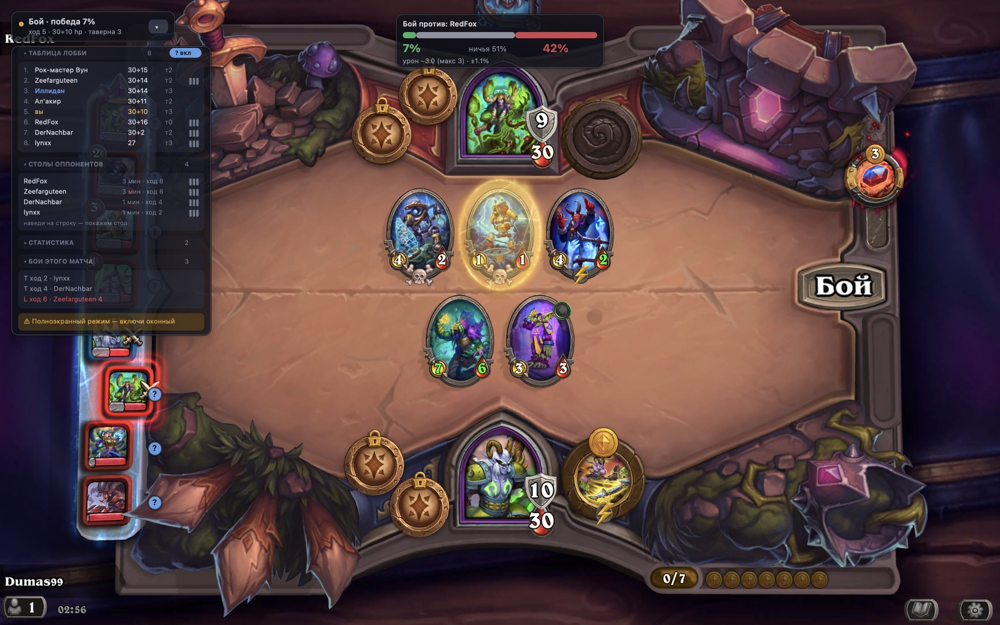
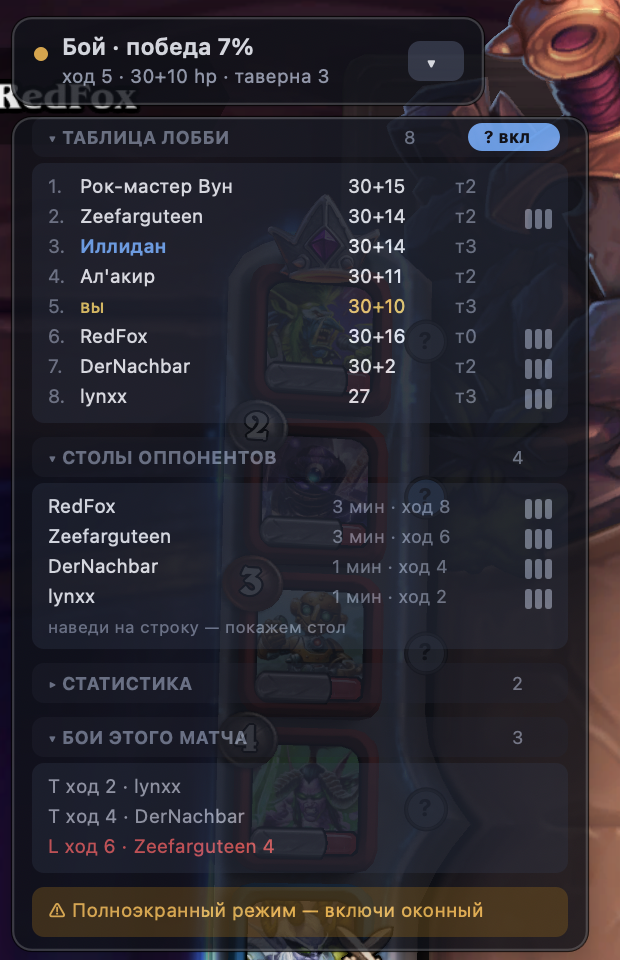

# HSBG Overlay — оверлей для Hearthstone Battlegrounds на macOS

Показывает поверх Hearthstone вероятность выигрыша текущего боя, последние
известные столы всех оппонентов, таблицу лобби, трекер пула миньонов и
статистику по твоим матчам.

Работает **только на чтение**: разбирает `Power.log`, который игра пишет сама.
Никакого чтения памяти процесса, инъекций или сетевого взаимодействия с игрой —
тот же механизм, на котором работают HSTracker и Hearthstone Deck Tracker.

[English README](README.md) · [Инструкция по установке](docs/INSTALL.ru.md) · macOS 12+ · Python 3.13 · MIT



---

## Установка

Пошаговая инструкция с таблицей «если что-то не работает» —
**[docs/INSTALL.ru.md](docs/INSTALL.ru.md)**. Коротко:

```bash
git clone https://github.com/Dimus99/hsbg-overlay.git
cd hsbg-overlay
./setup.sh
```

Скрипт создаёт venv на Python 3.13 (arm64) и ставит PyObjC. Затем проверь окружение:

```bash
./run.sh --check
```

Ожидаемый вывод — найденная папка логов, определённый язык игры и размеры окна
Hearthstone.

## Запуск

```bash
./run.sh
```

В строке меню появится значок **BG** — оттуда можно скрыть оверлей или выйти.

### Приложение

Чтобы запускать без терминала, собери настоящее macOS-приложение:

```bash
./make_app.sh
```

В `dist/` появится **HSBG Overlay.app** (~23 МБ). Внутри — свой Python, PyObjC
и код оверлея, так что приложение не зависит ни от этой папки, ни от `.venv`:
перетащи его в `/Applications`, в Dock, скопируй на другой Mac — работает.
Собрать сразу в нужное место: `./make_app.sh /Applications`.

Открой двойным щелчком — откроется окно с одной кнопкой:

* **Запустить / Остановить** — стартует и гасит оверлей. Надпись на кнопке и
  строка состояния показывают, работает ли он прямо сейчас.
* **Проверить окружение** — то же, что `./run.sh --check`, только вывод
  появляется тут же в окне.
* Внизу — живой хвост журнала, так что упавший запуск видно сразу, а не
  «ничего не произошло».

Оверлей запускается отдельным процессом, поэтому окно можно закрыть — оверлей
останется работать, а открыв окно снова, ты увидишь его состояние и сможешь
остановить. Само окно доступно и без сборки: `./run.sh --launcher`.

Вывод пишется в `~/Library/Logs/HSBG-Overlay.log`. Настройки и кэш карт — в
`~/Library/Application Support/hsbg-overlay/`, они общие у собранного
приложения и у запуска из терминала.

Сборку описывает `packaging/hsbg.spec` (PyInstaller), точка входа —
`packaging/entry.py`, иконку рисует `tools/appicon.py`. PyInstaller нужен
только для сборки, `make_app.sh` ставит его сам. Подпись — ad-hoc: для себя
достаточно, для раздачи другим нужен Developer ID и нотаризация, иначе
Gatekeeper на чужом Mac попросит открыть через правую кнопку → «Открыть».

### Важно: оконный режим

macOS не позволяет рисовать поверх приложения в **эксклюзивном полноэкранном**
режиме — окно игры уезжает на отдельный Space. В настройках Hearthstone
(Графика) выбери **Оконный** или **Оконный без рамки**. Если этого не сделать,
оверлей будет исправно работать, но останется за игрой. `./run.sh --check`
скажет, в каком режиме сейчас игра.

Разрешение на запись экрана **не требуется** — размеры окна берутся из
публичного списка окон.

---

## Интерфейс



Четыре независимых окна вместо одной длинной панели — у каждого своя роль.

### 1. Главная плашка (всегда на экране)

Маленькая, в углу окна игры. Показывает текущее состояние: во время боя —
`Бой · победа 62%`, в остальное время — ход, здоровье и уровень таверны.
Справа кнопка **▾ / ▸**: сворачивает и разворачивает **всё остальное**. Состояние
запоминается между запусками.

### 2. Шансы (только во время боя)

Появляется **сверху по центру окна игры** — там, где и так смотришь во время боя,
— и исчезает, когда бой отыгран.

**Почему это было неочевидно.** Hearthstone сбрасывает весь бой в лог одним
куском и только потом его анимирует. Замерено на девяти боях подряд: запись в
лог заканчивалась через 0.3–1.8 секунды, а первый реальный клик игрока в таверне
приходил через **20–84 секунды**. Все внутрилоговые признаки «бой закончился» —
возврат таверны, тик счётчика ходов, изменение стола — срабатывают внутри этого
всплеска, а попытка оценить длину анимации по числу атак обрывала плашку прямо
посреди боя.

Поэтому сигнал окончания — сам игрок: шансы висят **до твоего первого действия в
таверне**. Страховка на случай, если ты вообще ничего не кликнешь, — 60 секунд
(`combat_hold_seconds` в настройках).

**Конец матча — отдельный сигнал.** У этой страховки была обратная сторона: матч
кончился, ты уже в меню Battlegrounds выбираешь следующий, а поверх меню всё ещё
висит «Бой против: Carbona · 0%» и «ход 10 · 11 hp» из партии, которой больше
нет. В Power.log ответа нет вовсе — там последняя партия так и лежит до
`CREATE_GAME` следующей, а если оверлей запустить, стоя в меню, он эту партию
честно вычитает из лога и покажет как живую. Замерено на записи: `STATE=COMPLETE`
в 05:33:06, а из сцены матча игрок вышел в 05:33:59 — 53 секунды.

Поэтому вторым источником читается `LoadingScreen.log`, где игра пишет смену
экрана (`GAMEPLAY` → `BACON`). Ушёл со сцены матча — гаснут шансы, кружки «?»,
счётчик хода и наведение на портреты в игре; главная плашка возвращается к
«Ожидание матча Battlegrounds…». `STATE=COMPLETE` при этом только подводит итог
последнего боя и не убирает его с экрана: ты в этот момент ещё смотришь, как он
доигрывается. Если раздел `LoadingScreen` в `log.config` ещё не включён (он
добавляется при первом запуске и требует перезапуска игры), сцена неизвестна — и
тогда оверлей считает, что матч идёт, чтобы не гасить себя из-за отсутствующего
лога.

Внутри плашки: полоса победа/ничья/поражение, ожидаемый и максимальный урон,
доверительный интервал, риск смертельного исхода и отметка о точности, если на
столах есть немоделированные карты. Вне боя ничего не считается — процессор во
время закупки свободен.

**Пока прогноза нет — плашка загрузки.** Между меткой начала боя и первой атакой
игра ещё только выкладывает в лог стол оппонента: бой уже идёт, а читать его
рано. Раньше в это окно попадал пересчёт и показывал шансы **прошлого** боя —
секунду-две висели чужие цифры, потом их сменяли правильные. Теперь на это время
(и на время самой симуляции) на месте шансов появляется бегунок с именем
соперника и подписью «считаем расклад…», а главная плашка пишет `Бой · считаем…`.
Ширина и заголовок совпадают с готовой карточкой, так что она не прыгает.

### 3. Сворачиваемые блоки

Под главной плашкой. Клик по заголовку сворачивает блок, состояние сохраняется.

| Блок | Что в нём |
|---|---|
| **Выбор героя** | появляется только на выборе: каждый герой с твоим средним местом по нему и глобальным, если настроен внешний источник |
| **Таблица лобби** | все 8 игроков: место, здоровье, уровень таверны |
| **Столы оппонентов** | список — кого видели, сколько у них миньонов и когда; строки с сохранённым столом помечены значком из трёх полосок справа, наведи на такую — покажем стол |
| **Статистика** | твоё среднее место, винрейт боёв, результаты с текущим героем |
| **Бои этого матча** | история боёв с фактическим уроном |

### 4. Всплывающие окна по наведению

Появляются у курсора и ничего не занимают на экране постоянно.

* **Наводишь на героя** — в таблице лобби оверлея *или на портрет игрока в самой
  игре* — всплывает его последний стол **самими картами**, как они выглядели в
  начале боя. Само по себе это не видно, поэтому строки, по которым есть что
  показать, помечены маленьким значком справа (три полоски — мини-стол), строка
  под курсором подсвечивается, а под списком столов висит подсказка. Если стола
  ещё не видели, всплывашки не будет вовсе: серый кружок «?» на портрете уже
  это и означает, и лишняя плашка только загораживала бы игру. Поверх картинок нарисованы живые атака и здоровье из лога: на самой
  карте напечатаны базовые числа, а важны те, с которыми миньон реально дрался.
  Всплывашка пристыковывается сбоку к той строке, на которую наведено, а когда
  привязываться не к чему — встаёт правее курсора на **три его ширины** (ширина
  меряется по непрозрачной части системной стрелки, а не по её 64-точечной
  картинке с полями).

  Картинки — «сырой» арт с HearthstoneJSON, рамка своя. Готовые рендеры карт
  выглядели бы лучше, но там покрыты только старые сеты: из 13 миньонов текущего
  матча 11 отдавали 404. Арт есть для всех карт, и своя рамка заодно позволяет
  положить живые статы туда, где они читаются. Золотые карты используют арт
  обычной версии и помечаются золотой рамкой. Всё кэшируется на диск.

  Две вещи, из-за которых карты выглядели криво. Во-первых, эндпоинт `256x`
  отдаёт **квадрат**, а сам арт вертикальный — разницу он добивает белыми
  полями, и они лезли прямо в ячейку карты. Теперь поля срезаются один раз при
  скачивании (плюс 1 px на белёсый ореол от JPEG на границе), и в кэше лежит уже
  обрезанный арт. Во-вторых, картинка растягивалась под квадратную ячейку —
  теперь она её *заполняет* с обрезкой по высоте, со смещением к верху, где
  голова: по ней миньон и узнаётся.
* **Наводишь на миньона в таверне** — всплывает, сколько копий этой карты
  осталось в общем пуле, сколько уже замечено на чужих столах, и текст карты.

Hearthstone не пишет наведение мыши в лог, поэтому наведение **в самой игре**
определяется по положению курсора относительно окна. Зоны заданы в долях окна,
так что переживают смену разрешения, но это всё же оценка вёрстки Blizzard.

Раз зону не видно, её видно не было и глазами: приходилось водить курсором и
угадывать, где сработает. Поэтому поверх рейки портретов можно включить
маленькие кружки **«?»** — по одному на слот. Кружок и есть точка наведения:
синий — стол этого игрока у нас есть, серый — ещё не видели, золотой — курсор
сейчас на нём. Своего портрета кружок не получает.

**Всплывашка в игре срабатывает только на самом кружке и только когда кружки
включены.** Раньше хот-спотом была вся полоса рейки — вся её ширина на всю
высоту слота, — и стол оппонента вылезал, когда курсор просто проходил слева от
портретов по своим делам, даже с выключенными кружками. Ничего на экране про эту
полосу не говорило, так что выглядело это как случайно всплывающий чужой стол.
Теперь рисование и попадание считаются **одной и той же функцией**
(`hover.mark_layout`): нет кружка — нет и наведения. Через плашку самого
оверлея столы, как и раньше, открываются всегда.

Кружки живут **отдельно от панелей**: они рисуются поверх рейки самой игры и
имеют свой переключатель, поэтому сворачивание оверлея их не убирает. Наоборот —
свернуть и оставить кружки это и есть основной способ смотреть чужие столы, не
загораживая игру.

**По умолчанию их нет.** Кружки рисуются поверх чужой картинки — игры, — а нужны
далеко не всегда: включаешь, когда зона сбита или пока привыкаешь, где она.
Переключатель — пилюля **«? вкл / ? выкл»** в шапке блока «Таблица лобби», то
есть напротив тех самых оппонентов, чьи портреты они помечают; то же самое есть
пунктом в меню значка **BG** в строке состояния, который доступен всегда, даже
когда панели свёрнуты. Состояние сохраняется (`show_hover_marks`).

Если кружки не совпадают с портретами — зона сбита, запиши её по двум углам:

```bash
./run.sh --tool calibrate -- --set leaderboard
```

Инструмент попросит навести на левый верхний угол самого верхнего портрета и на
правый нижний угол самого нижнего, после чего сам запишет зону в настройки.
Без `--set` он просто показывает долю под курсором:

```bash
./run.sh --tool calibrate
```

Поводи мышью над портретами и над миньонами Боба, запиши углы и положи в
`settings.json`:

```json
"extra": {"hover_zones": {"leaderboard": [0.0, 0.09, 0.085, 0.96],
                          "tavern":      [0.20, 0.215, 0.80, 0.42]}}
```

Наведение на строки в самом оверлее работает точно и калибровки не требует.

---

## Точность симулятора

Симулятор **точно** моделирует всё, что есть в логе: атаку, здоровье,
Божественный щит, Провокацию, Яд/Отраву, Возрождение, Вихрь, а также порядок
атак, выбор целей и подсчёт урона герою.

Ключевой приём: снимок обоих столов берётся **прямо перед первой атакой**, а не
в начале боевой фазы. К этому моменту игра уже сама применила все эффекты начала
боя — способности героя, аксессуары, Rally, ауры — и они попадают в статы
бесплатно, без единой строчки моделирования.

У приёма есть ровно одна дыра: сила героя, которая срабатывает на событие,
которого в момент снимка **ещё не было**. Такие силы берутся из базы по
`heroPowerDbfId` героя, и их сейчас три вида:

| Сила | Что делает в бою |
|---|---|
| Серокрон | «+1/+2 и Провокация призванным в бою» — из-за неё два одинаковых стола 1/1 расходятся в поражение: его скелеты встают 2/3 с провокацией, а твои остаются 1/1 |
| Рокара | «когда союзник убивает врага, дай ему +1 к атаке навсегда» — счётчик растёт прямо посреди боя |
| Дрек'Тар, Ваннадар | «когда в бою появится место, призови копию самого сильного/живучего существа» — взводится, только если стол вошёл в бой **полным**: при 6 существах игра уже призвала копию до снимка, и она в нём стоит |

Остальные силы либо работают в таверне, либо срабатывают в начале боя — и то и
другое уже вшито в статы снимка.

**Аксессуары.** Из 390 аксессуаров 283 работают только в таверне, а из
остальных в бою действуют два класса, которых снимок показать не может:

| Класс | Что моделируется |
|---|---|
| «когда появится место, призови…» | Automaton Portrait (настоящий 3/4 Древний автоматон), Boom Controller (точная копия первого павшего меха — с баффами, не «чистая»). Взводится так же, как у Дрек'Тара: безусловный — только если стол вошёл в бой полным, зависящий от смерти — всегда |
| `Возмездие (N)` | счётчик живёт **на столе**, а не на существе: у аксессуара нет тела, его нельзя ни убить, ни занулить. Bird Feeder, Beetle Band, Staff of the Scourge, Gilnean Thorned Rose |

Сами id читаются из лога: свои — по контроллеру, чужие — по id из блока настройки
боя (у оппонента каждый бой новый контроллер-прокси, поэтому по нему фильтровать
нельзя). Карточки-заглушки «Lesser/Greater Trinket» отбрасываются. Заполненность
столов аксессуарами выросла с **0% до 56%** — поле `trinkets` существовало с
самого начала и доезжало до симулятора, но никогда ничем не заполнялось.

**Племя у токенов.** «Призови 2/2 Жука» разбиралось в безымянное тело без
племени, и все табличные баффы («дай своим зверям +4/+4») пролетали мимо тех
самых тел, которые карта только что и создала. Теперь по названию из текста
подтягивается настоящая карта: id, племя, уровень и ключевые слова, а
напечатанные статы остаются главнее. Это же починило сопоставление в
`tools/divergence.py`.

Механики, которых в логе нет, извлекаются **автоматически из текста карт**
английской базы HearthstoneJSON в машинный вид и отыгрываются движком:

| Механика | Что моделируется |
|---|---|
| Предсмертный хрип | призыв токенов (с настоящими статами именованной карты), призыв случайной карты из пула («2 случайных миньона с предсмертным хрипом», «случайный зверь с 2–4 уровня», «4 случайных пирата»), урон (по случайному / всем / самому слабому / соседним), баффы, выдача ключевых слов, передача статов, убийство или бафф того, кто тебя убил, возврат погибших мехов из «кладбища», призыв из руки (по атаке, по здоровью, случайного — с баффом на выходе), «сделай правого золотым», запуск чужого хрипа |
| **Боевой раж (Rally)** | **цель удара**: урон по ней и по её соседям, «урон, равный своей атаке», «сделай её статы 3/3», «сними с неё Перерождение и Провокацию», «забери её атаку»; плюс баффы по позиции («существу справа +2/+2»), Кровавые самоцветы на себя и на остальной стол, удвоение своих статов, «получи атаку, равную своему уровню», самоуничтожение после удара, запуск чужого хрипа (Чудовищный ара), лимиты «раз/дважды за бой» |
| Возмездие | порог срабатывания, баффы, урон, Кровавые самоцветы |
| Ярость (Frenzy) | срабатывает один раз, при первом пережитом уроне |
| «Когда получает урон» | баффы, призыв, лимиты вида «дважды за бой» |
| «Когда убивает миньона» | рост статов, «получи его максимальные статы», отдельно «когда атакует и убивает» |
| «Когда союзник умирает» | Avenge-счётчики, «получи его атаку/статы», **«получи его предсмертный хрип»** (Рыба Н'Зота копит чужие хрипы) |
| «Когда призываешь существо» | и «during combat», и «in combat» — бафф призванному, бафф себе, ключевые слова |
| Раскол, потеря щита | как раньше |
| **Ауры на чужие триггеры** | Titus Rivendare: «ваши предсмертные хрипы срабатывают ещё раз» — множитель считается **в момент срабатывания хрипа**, поэтому Тит, павший в той же волне смертей, уже ничего не удваивает; золотой даёт ×3. Умноженным оказывается и хрип, запущенный чужой картой (Чудовищный ара, Deathstrider), — как в игре |
| **«После атаки союзника с Rally»** | Deathstrider: «запусти свой левый предсмертный хрип» (золотой — дважды). Отдельный хук от обычного «когда союзник атакует»: смотрит на ключевое слово Rally у бьющего и срабатывает **после** размена, а не до. Существо с Вихрем заводит его дважды за ход |
| **«Твои Жуки получают +5/+5 в этой игре»** | не бафф стоящим телам, а распоряжение на все токены, призванные дальше: копится на столе, переживает смерть того, кто его выдал, и достаётся каждому новому Жуку в момент призыва. Раньше клауза просто выбрасывалась — стол на Жуках отыгрывался так, будто его токены не растут вообще |

### Стол, который сам себя растит

Жуковый стол — тот самый бой из журнала, где обещали 0% и вышла победа, — держится
не на статах, а на трёх механиках, каждая из которых по отдельности выглядит
безобидно: **Deathstrider** запускает левый хрип после каждого удара Rally-существа,
**Бирюзовый быстролап** этим хрипом выдаёт Жукам +5/+5 «в этой игре», а **Тит
Ривендер** удваивает и то и другое. Золотой Грифон с Вихрем заводит цепочку дважды
за ход. Ни одна из трёх не была разобрана: движок видел ванильные тушки и уверенно
считал бой проигранным.

Порядок внутри хрипа важен ровно так же, как в тексте карты: «Твои Жуки получают
+5/+5 в этой игре. **Потом** призови 2/2 Жука» — сначала распоряжение, потом тело,
иначе первый же Жук выходит без прибавки, которую карта только что выдала.

**Замер.** 212 боёв из трёх записанных логов, один и тот же набор, прогнан дважды —
со старой таблицей эффектов и с новой. Угаданных исходов 80.2% → 80.7%, Brier
0.1233 → 0.1208, «уверенно мимо» (меньше 2% вероятности на то, что случилось)
19 → 16. Сильно (больше 5 пунктов) сдвинулись три боя, все три — в сторону того,
что произошло на самом деле: `84→98%`, `86→92%`, `34→82%`, и все три были
победами. Ни один бой не съехал в неверную сторону. Прирост скромный именно
потому, что пакет узкий: в этих логах он встретился три раза из двухсот.

**Чего всё ещё не хватает.** Прибавка, накопленная за прошлые ходы, в снимке не
видна: бой начинается с «Жуки +0/+0», хотя в игре к этому моменту там могло быть
+150/+150. Прогноз от этого занижен, поэтому такие карты **специально помечены как
разобранные не полностью** (`game_carryover`) — оверлей покажет «точность ~71%»
вместо стопроцентной уверенности в поражении. Полное решение в логе есть: игра
вешает на каждого призванного Жука чару `BG31_808e` и тут же выставляет ему
итоговые ATK/HEALTH, так что накопленную прибавку можно вычитать из токенов,
призванных в предыдущих боях. Это следующий шаг, а не сделанное.

Три приёма, из-за которых покрытие выросло сразу на десятки карт:

* **Общая шапка триггеров.** «Battlecry, Deathrattle, and Rally: дай остальным
  +2/+2» — один текст на три триггера. Разрезалка искала маркер `Deathrattle:`,
  не находила его и записывала карту в ванильную тушку. Теперь такая шапка
  разворачивается в отдельное предложение на каждый триггер, и дальше работают
  все прежние шаблоны.
* **Заклинания по имени.** «Rally: Cast Queen's Command» — само заклинание
  почти всегда обычный бафф, так что его текст подставляется в клаузу перед
  разбором, а не заводит отдельный список карт.
* **Множественное число племён.** «4 случайных пирата» не находило племя
  `PIRATE`, потому что в таблице лежит единственное число, — и призывало ноль
  существ.

Что не выводится из текста автоматически, лежит в `MANUAL_EFFECTS` (сейчас
пусто — руками не пришлось прописывать ни одной карты).

### Измерено на 235 реальных боях из твоих логов

Замер делает `tools/accuracy.py`: он сравнивает предсказание с **фактическим**
исходом каждого боя, взятым из того же лога.

Исход берётся из самого лога: игра печатает `META_DATA - Meta=DAMAGE` с указанием,
чей герой получил урон, — это и есть результат боя, без домыслов. Раньше исход
выводился из разницы здоровья между боями, и метки врали: бой «мой 4/4 против
1/1» записывался как поражение. Из 279 боёв 245 теперь размечены логом напрямую,
остальные 34 (в основном ничьи, где урона нет ни у кого) — прежней эвристикой.

Замер на 206 боях из свежих логов (после этой правки / до неё):

| Метрика | Стало | Было |
|---|---|---|
| Самый вероятный исход угадан | 79.1% | 79.7% |
| Brier score вероятности победы | 0.132 | 0.126 |
| Средняя ошибка по урону | 2.0 | 1.9 |
| Покрытие карт | **97%** | 95% |
| Боёв, разобранных **полностью** | **168 из 206** | 138 из 202 |

Итог честный: сводные числа не сдвинулись — они гуляют на ±1.5 п.п. от прогона
к прогону, и новые механики просто редко встречались в этих конкретных боях.
Сдвинулось другое — на 30 боёв больше теперь разобраны **целиком**, то есть
оверлей перестал приписывать к ним «точность ~85%». Выигрыш там, где боевой раж
реально стоит на столе: Син'дорай-снайпер и Донный вербовщик были в списке
промахов базового замера как неразобранные, теперь их нет.

Более ранний замер на 286 боях:

| Метрика | Без потолка урона | С потолком |
|---|---|---|
| Самый вероятный исход угадан | 77.5% | 77.5% (±0.8) |
| Brier score вероятности победы | 0.162 | 0.162 (0.25 — монетка) |
| Средняя ошибка по урону | 4.3 | **2.6** |
| Прогнозов выше игрового потолка | 67 из 284 | **0** |
| Покрытие карт | 98% | 98% |

Доля угаданных исходов гуляет на ±1.5 п.п. от прогона к прогону: в куче боёв
шансы близки к 50/50, и «самый вероятный исход» там переворачивается от случайной
выборки. Brier score стабилен — по нему и стоит сравнивать.

**Потолок урона.** Battlegrounds ограничивает урон за проигранный бой: 2 в начале
матча, дальше 5, 10 и 15 — игра пишет это в теге `BACON_COMBAT_DAMAGE_CAP`.
Симулятор умел его учитывать, но приложение никогда не передавало значение, и
оверлей обещал «урон ~32» там, где игра не могла снять больше 15. Теперь потолок
читается из лога и попадает и в прогноз урона, и в риск смертельного исхода.

**Что ещё остаётся.** На 286 боях 32 раза (11%) движок был уверен на 90%+ и
ошибся. Это уже настоящие промахи симулятора, а не кривые метки, — разбор
конкретных боёв продолжается.

Оверлей показывает строку `точность ~85% · не смоделировано: <карты>`, когда на
столах есть карты с неразобранным боевым триггером — к проценту победы тогда
стоит относиться осторожнее. Триггеры, которые срабатывают в таверне или в руке
(«получи Кровавый самоцвет», «дай миньону в руке +7/+7»), покрытие не занижают:
на текущий бой они не влияют. Начало боя тоже не занижает — оно уже вшито в статы.

Перемерить на своих логах в любой момент:

```bash
./run.sh --tool accuracy
```

### Производительность

Замерено на этой машине (M-серия, 803 МБ логов):

| Стадия | Результат |
|---|---|
| Разбор лога | 185 тыс. строк/с — при живой игре запас ~185× |
| Симуляция боя 7×7, 2000 прогонов | 0.53 с на 8 процессах (3 772 прогона/с) |
| Оверлей в покое | 2–3% одного ядра, 120 МБ |
| Первый разбор истории | ~30% одного ядра, дальше из кэша за 0.9 с |

Python здесь не узкое место. Прогноз считается один раз за бой и занимает
полсекунды при 8–40 секундах анимации, а точность упирается не в число прогонов: 2000 итераций дают ±2.2 п.п.
статистического разброса, тогда как систематическая ошибка от несмоделированных
карт — порядка ±10 п.п. Переписывание движка на Rust убрало бы ±2.2 и не тронуло
бы ±10.

Где быстрый язык действительно понадобился бы — перебор расстановки миньонов
(7! = 5040 вариантов × 1000 прогонов ≈ 5 млн боёв). В Python это ~12 минут, в
Rust — секунды. Если такая подсказка нужна, имеет смысл вынести в нативный
модуль только движок боя, оставив остальное как есть.

### Сравнение траекторий: чем чинить дальше

Замер по исходам (`tools/accuracy.py`) говорит, *как часто* движок ошибается, но
никогда — *почему*: в бою 7×7 сорок ударов, и одно неверное правило где угодно
переворачивает результат. Зато Power.log называет **обе стороны каждого удара** —
тегами `PROPOSED_ATTACKER` / `PROPOSED_DEFENDER` внутри каждого `ATTACK`-блока
(в шапке блока `Target=` всегда 0, там ничего нет). Это готовый список ходов игры.

`tools/divergence.py` прижимает симулятор к этому списку: на каждом шаге
спрашивает движок, кем бы он ударил, сравнивает с реальностью и **навязывает**
реальный выбор, чтобы реплей не сходил с настоящей траектории. Случайность выбора
цели перестаёт мешать, и остаются только расхождения правил — двух видов:

| | что это значит |
|---|---|
| `order` | движок выбрал другого атакующего — указатель атаки, место призыва, учёт Вихря |
| `state` | движок считает настоящего атакующего или его цель уже мёртвым — не отыгран эффект |

Тела, призванные в бою, у симулятора не имеют id, поэтому привязываются к id из
лога по карте. Если привязать нельзя — реплей **останавливается**, а не сообщает
о расхождении: выход из отслеживаемой зоны не баг движка, и считать его багом
значило бы утопить настоящие находки. И считается только **первое** расхождение
в бою: всё после него — следствие уже разъехавшегося стола.

```bash
./run.sh --tool divergence -- --min-swings 2
```

Запись хода боя (`CombatRecord.trace`) включается флагом `trace_combat` и по
умолчанию выключена — живому оверлею она не нужна.

Инструмент сразу переставил приоритеты. Гипотеза «виноват порядок атак» **не
подтвердилась**, а виноваты тела, которых движок не создаёт. На 194 боях:

| | было | стало |
|---|---|---|
| досмотрено до последнего удара | 32.1% | **37.1%** |
| вышли из отслеживаемой зоны | 59.8% | **51.5%** |
| медиана доли ударов до остановки | 42% | **46%** |
| Brier | 0.140 | **0.137** |

Он же печатает **ранжированный список карт**, которые игра призывала, а
симулятор нет, — то есть готовую очередь работ вместо догадок.

### Журнал боёв (отладка)

В меню значка **BG** есть переключатель **«Отладка: журнал боёв»** и рядом
**«Открыть папку журнала»**. По умолчанию выключен — это диагностика, а не то,
что нужно обычной сессии.

Когда включён, каждый завершившийся бой дописывает одну строку JSON в
`~/Library/Application Support/hsbg-overlay/debug/combats-ГГГГ-ММ-ДД.jsonl`:
прогноз, фактический исход, **оба стола целиком** (статы, ключевые слова,
позиции, аксессуары, рука) и поле `surprise` — сколько вероятности прогноз отдал
чему угодно, кроме случившегося. Столы пишутся полностью специально: Power.log
ротируется и весит десятки миллионов строк, а по этой строке бой воспроизводится
и через неделю.

Читать журнал:

```bash
./run.sh --tool debugreview -- --boards
```

Он печатает калибровку («из боёв, обещанных на 0–2%, сколько реально выиграно»)
и сортирует промахи по уверенности. Самый ценный случай — **0% и победа**: это не
разброс, 2000 прогонов не нашли ни одного пути к победе, значит стол в
симуляторе не был столом в игре.

Первый же прогон на записанных логах нашёл именно такой бой — гигантский стол
проиграл семи мелким существам, — и назвал виновных: **Titus Rivendare** («ваши
предсмертные хрипы срабатывают ещё раз») и **Deathstrider**. Обе карты движок не
отыгрывал **и не помечал как неразобранные**, так что оверлей показывал «покрытие
100%» рядом со стопроцентно неверным прогнозом. Сначала появилась пометка, теперь
и отыгрыш — см. «Стол, который сам себя растит» ниже.

**Две ловушки самого журнала**, из-за которых он врал о том, что происходило.

*Прогноз доставался не тому бою.* Симуляция идёт на своём потоке секунду и
дольше, а читатель лога в это время не стоит. Раньше готовый ответ пришивался к
`state.current_combat` **в момент окончания счёта** — то есть к тому бою, который
к тому времени стал текущим. При обычной игре это редкая гонка, но оверлей
стартует с чтения лога от последнего `CREATE_GAME`, и весь уже сыгранный матч
пролетает через парсер за пару секунд — там это правило, а не исключение. В
журнале это выглядело как «обещали 0%, вышла победа»: цифры были честные, просто
от другого хода. Теперь бой едет вместе со столами от `_matchup()` до записи.

*Один матч писался в журнал каждый перезапуск.* То же стартовое перечитывание
лога доигрывает все прошедшие бои заново и честно «засчитывает» каждый — с пустым
прогнозом, потому что предсказывать было нечего. В файле копились дубли, а
таблица калибровки считала их за отдельные наблюдения. Читатель лога теперь
говорит, догнал ли он писателя (`PowerLogTailer.caught_up`), и бои из этого
хвоста в журнал не идут.

### Что не смоделировано

Неразобранных боевых триггеров осталось 74 на 71 карте (считая золотые версии
отдельно) — это 42 уникальные карты, из них 14 помечены только за невидимый
«накопленный в этой игре» хвост. Остаётся:

* **аксессуары** сверх двух разобранных классов (см. ниже): те, что выдают
  существам предсмертный хрип («дай своим кабанам „Хрип: получи 2 самоцвета“»),
  и те, что зависят от «первого призванного за бой» (Twin Sky Lanterns);
* **Кровавые самоцветы как счётчик**: «призови голема со статами, равными
  Кровавым самоцветам этого существа» (Порченый щетинник, Тюремный джаггернаут,
  Искажённый щетинник) — сколько самоцветов на существе, из снимка не видно;
* **немедленная атака**: «твоё левое существо немедленно атакует того, кто это
  убил» (Опытный техник), whelp'ы Ониксии — движок умеет призывать тело, но не
  давать ему удар вне очереди;
* **чужие боевые кличи**: «запусти боевой клич соседа» (Рилак, Садовник) —
  боевые кличи в бою не отыгрываются вовсе;
* **порог статов**: «как только атака дойдёт до 6, получи Божественный щит»
  (Алый выживший) — мид-бой за статами никто не следит;
* **превращения**: «Возмездие (5): стань копией существа слева» (Кармический
  хамелеон), магнетизм из хрипа (Апекситовый страж);
* **накопленное «в этой игре»**: сколько именно раз к твоим Жукам успели
  прибавить +5/+5 за прошедшие десять ходов, в снимке не написано нигде —
  моделируется только то, что накапливается внутри самого боя (см. ниже);
* карты, зависящие от **содержимого руки соперника** — руки в логе просто нет,
  и это принципиально: своя рука учитывается, чужая никогда;
* Duos-режим (парные Battlegrounds).

**Перерождение и Божественный щит.** Была гипотеза, что Перерождение поднимает
карту с её *печатными* ключевыми словами, то есть возвращает лопнувший
Божественный щит. Реализовал, замерил на 207 боях — и точность упала с 79.7% до
74.4%, а Brier с 0.128 до 0.181. Игра щит не возвращает; тело встаёт ровно таким,
каким легло, минус жизни и минус само Перерождение. Гипотеза откачена, а вывод
записан комментарием в `engine.summon_reborn`, чтобы её не переоткрывали.

Свежий список в любой момент:

```bash
./.venv/bin/python -c "from hsbg.carddb import get_db; db = get_db(); spec = db.derive_effects(); print('\n'.join(sorted({db.name(i) + ' ' + str(s['unmodelled']) for i, s in spec.items() if s.get('unmodelled')})))"
```

## Настройки

`~/Library/Application Support/hsbg-overlay/settings.json` (создаётся при первом
запуске):

| Ключ | По умолчанию | Смысл |
|---|---|---|
| `iterations` | 2000 | симуляций на прогноз |
| `sim_workers` | 0 (авто) | процессов под симуляцию |
| `language` | `auto` | `auto` / `ruRU` / `enUS` / любая локаль HearthstoneJSON; задаёт и имена карт, и подписи самого оверлея |
| `anchor` | `top-left` | к какому углу окна игры крепиться |
| `offset_x`, `offset_y` | 16 | отступ от края |
| `overlay_opacity` | 0.88 | прозрачность |
| `overlay_scale` | 1.0 | масштаб |
| `show_opponents`, `show_leaderboard`, `show_pool`, `show_stats` | `true` | какие данные собирать |
| `show_when_hs_inactive` | `false` | держать оверлей на экране, даже когда Hearthstone не в фокусе или вовсе не запущен |
| `show_hover_marks` | `false` | кружки «?» на портретах оппонентов в игре; переключаются кнопкой в шапке «Таблица лобби» и пунктом меню в строке состояния |
| `extra.hidden` | `false` | свёрнут ли оверлей до главной плашки |
| `extra.collapsed` | `{}` | какие блоки свёрнуты |
| `extra.hover_zones` | — | калибровка зон наведения в игре |
| `offline` | `false` | не ходить в сеть (нужен прогретый кэш карт) |

Язык определяется автоматически, и на нём же оверлей пишет свои подписи: игра
на английском — весь интерфейс на английском, игра на русском — на русском.
Источники по убыванию достоверности: строка `SetLocale:` в начале
`Hearthstone.log` (что игра действительно выбрала при запуске), выбранный язык
текста в `.product.db` Battle.net, язык самого Battle.net, локаль оболочки.
Читать `.product.db` пришлось по номерам полей протобуфа: рядом с выбранным
языком лежит список *установленных*, и поиск по всему файлу находил русский у
всех, у кого он просто скачан. При смене языка игры править ничего не нужно —
достаточно перезапустить оверлей после игры. Внутренне всё привязано к
`cardId`, который от языка не зависит; свои подписи живут в `hsbg/i18n.py`.

### Внешняя статистика

Публичные сайты со статистикой Battlegrounds (HSReplay, Firestone) закрыты
Cloudflare-защитой от ботов и не имеют открытого API, а обходить защиту я не
стал. Поэтому по умолчанию внешний источник не настроен, и статистика — в том
числе подписи под героями на выборе — считается из твоих собственных логов.
Если у тебя есть подходящий источник, добавь в `settings.json`:

```json
"extra": { "stats_url": "https://example.com/bgs-heroes.json" }
```

Ожидаемый формат:

```json
{"heroes": [{"cardId": "TB_BaconShop_HERO_93", "averagePlacement": 4.21, "games": 12045}]}
```

---

## Инструменты разработки

```bash
./run.sh --tool replay    -- --combats --sim   # разобрать лог, показать столы и прогнозы
./run.sh --tool accuracy  -- --iterations 800  # измерить точность на своих логах
./run.sh --tool preview   -- --combat 5        # показать оверлей по записанному матчу
./run.sh --tool calibrate                      # подобрать зоны наведения в игре
./run.sh --headless                            # без окна, вывод в консоль
```

## Как это устроено

```
hsbg/
  logfiles.py    поиск и слежение за логами игры: Power.log и LoadingScreen.log
                 (переживает перезапуск игры)
  powerlog.py    токенизатор лога -> поток событий + таблица сущностей
  gamestate.py   состояние лобби: столы, лидерборд, история боёв
  carddb.py      база карт HearthstoneJSON + извлечение механик из текста
  sim/           движок боя, реестр эффектов, Monte-Carlo раннер
  pool.py        трекер пула миньонов
  stats.py       статистика из локальных логов + опциональный внешний источник
  i18n.py        подписи интерфейса на языке, в котором запущена игра
  ui/            окна AppKit, отрисовка, определение зон под курсором
  app.py         связывание потоков: лог + сцена -> состояние -> симуляция -> оверлей
  launcher.py    окно с кнопкой запуска: стартует и гасит оверлей, тянет журнал
```

Ключевая деталь разбора: во время боя игра копирует стол оппонента под
«призрачного» игрока (того, чей `GameAccountId` нулевой) — туда же попадают
миньоны таверны. Различить их можно только по тому, какие сущности созданы
внутри блока начала боя; именно так и определяется состав противника.

## Лицензия

MIT — см. [LICENSE](LICENSE).
